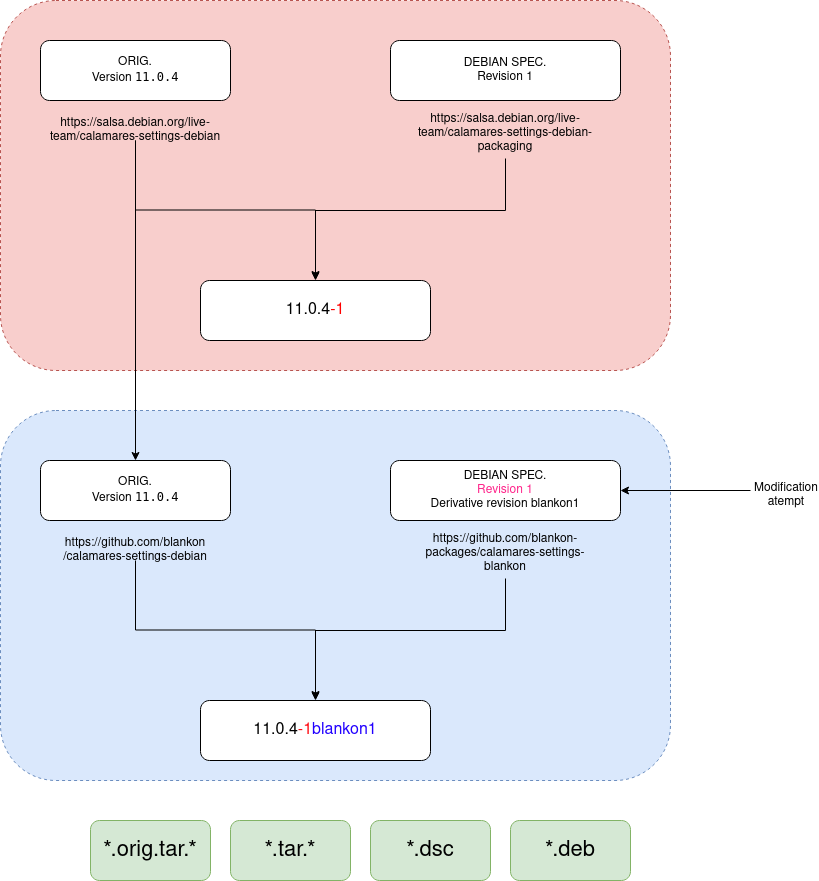

# Jenis Paket

Ada 2 jenis paket Debian, yaitu

### Paket native (Native package)

Paket ini memiliki kode sumber dan spesifikasi `debian` dalam satu direktori atau  *source tree*.

Paket ini ditandai dengan source format `3.0 (native)` dan penomoran versinya mengikuti hulu. Bila di hulu versinya `1.2.3`, maka di BlankOn cukup ditambahkan versi derivatif menjadi `1.2.3blankon1`.

Hasil pemaketannya adalah:

  - `*.dsc` - Debian Source Control
  - `*.deb` - Debian package
  - `*.tar.*` - Tarball kode sumber

Contoh paket:
- `base-files`
- `apt`

### Paket umum (third party package)

Paket ini tidak memiliki spesifikasi `debian` dalam direktori atau *source tree*-nya. Pengembang harus membuat spesifikasi `debian`-nya di tempat lain (biasanya lumbung kode) secara terpisah dan tidak menggabungkannya.

Paket ini ditandai dengan source format `3.0 (quilt)` dan penomoran versinya harus memiliki `revisi`. Bila di hulu versinya `1.2.3`, maka di BlankOn versinya ditambahkan revisi, menjadi `1.2.3-1`, lalu kemudian ditambahkan versi derivatif menjadi `1.2.3-1blankon1`

Hasil pemaketannya adalah:
  - `*.dsc` - Debian Source Control
  - `*.deb` - Debian package
  - `*.tar.*` - Tarball kode sumber (termasuk perubahan/tambalan yang dibawa oleh spesifikasi `debian`)
  - `*.orig.tar.*` - Tarball kode sumber yang **asli**, belum disentuh oleh perubahan/tambalan dari spesifikasi `debian`)

`*.orig.tar.*` hanya perlu diperbarui jika kita memperbarui perangkat lunaknya ke versi yang lebih tinggi dari hulu. `*.orig.tar.*` harus menyesuaikan dengan kode sumber yang telah diperbarui. Setiap jenis perubahan/tambalan/perbaikan harus terjadi di spesifikasi `debian`, bukan di kode sumber.

Contoh paket:
- GNOME
- Mozilla Firefox

## Ilustrasi

### Paket native tanpa modifikasi

### Paket native dengan modifikasi

### Paket non-native

